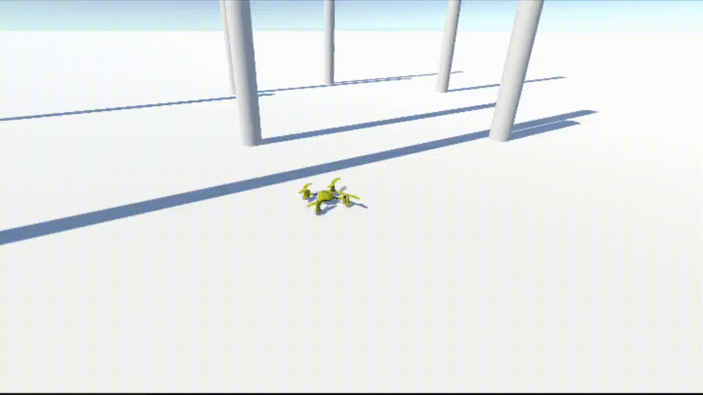
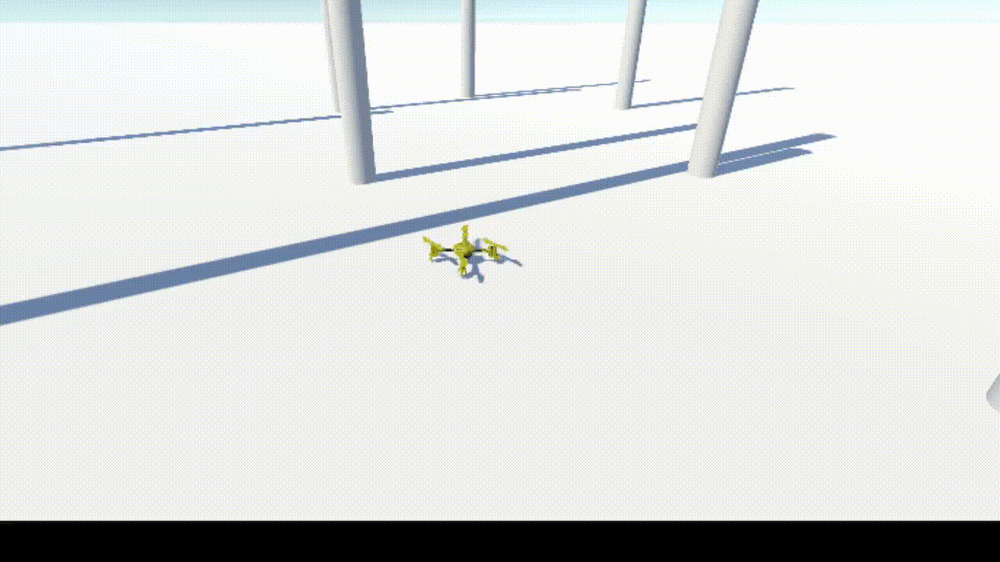

# UAV Reinforcement Learning Project

This project implements a reinforcement learning (RL) model to control an unmanned aerial vehicle (UAV) in Unity. The agent is trained using the Unity ML-Agents toolkit, with the objective of stabilizing the UAV and achieving flight control goals such as maintaining altitude, avoiding collisions, and reaching target positions.

## Introduction

This project aims to develop a UAV (drone) control system using reinforcement learning techniques. The UAV agent learns to stabilize itself, maintain a target height, and avoid obstacles. The agent is trained using the **Proximal Policy Optimization (PPO)** algorithm from Unity's ML-Agents framework.

### Key Features:

- **Unity environment** for drone physics simulation.
- **PID controllers** for stabilization.
- **Custom reward functions** that penalize instability and encourage target-seeking behavior.
- **Tensor-based observations** collected from onboard sensors (gyroscope, accelerometer, magnetometer, etc.).

### Results (May take several seconds to load):

  <figure>
    
    <figcaption>Manual Control</figcaption>
  </figure>
  <figure>
    
    <figcaption>AI Control</figcaption>
  </figure>

## Credits

This project uses assets obtained from the Unity Asset Store and other sources. Special thanks to the creators for providing these resources:

- **Realistic Drone** by AnanasProject - https://assetstore.unity.com/packages/3d/vehicles/air/realistic-drone-66698#publisher

All assets are used under their respective licenses. Thank you to the Unity Asset Store community for making these available!
